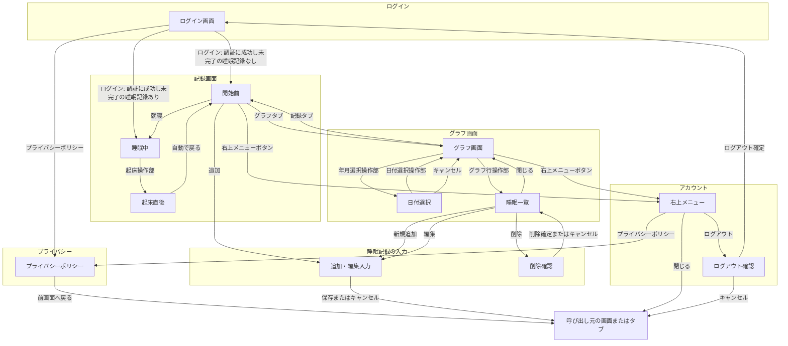

# 初回リリース詳細仕様

## 位置づけ

この文書には、最初の完成版を実装するための詳細な仕様を記録する。

-   機能の一覧と優先順位は [requirements.md](requirements.md) を参照する。
-   この文書では、機能の重複した一覧は作らず、記録・集計・画面・操作フローなどの具体的な決定を記録する。

## アプリ全体の仕様

### 利用・アカウント方針

-   v0 では製作者だけが、睡眠記録の登録・編集・閲覧を行える。
-   ログインには、メールアドレスのみを使うパスワードレス認証を用いる。
-   取得・保存する個人情報は必要最小限にする。
-   プライバシーポリシーを独立した画面として用意し、ログイン前とログイン後のどちらからも確認できるようにする。具体的な記載内容は、利用する認証・保存サービスの選定後に決める。

### 睡眠記録の扱い

-   睡眠記録は、所有者、就寝日時、起床日時を持つ。睡眠時間は就寝日時と起床日時から計算する。
-   「ねた」の操作では、現在時刻を就寝日時として、起床日時が未入力の睡眠記録を作成する。
-   「おきた」の操作では、起床日時が未入力の睡眠記録に現在時刻を記録して完了する。
-   記録画面には、現在の睡眠状態に応じた開始または終了の操作だけを表示する。就寝と起床の操作は同時に表示しない。
-   任意の就寝日時・起床日時を指定した追加、就寝日時・起床日時の編集、削除を行える。
-   昼寝や二度寝を含め、すべての睡眠を同じ睡眠記録として扱う。夜の睡眠だけを特別扱いしない。

### 睡眠日・日別集計・グラフ表示の定義

-   睡眠日は、起床した実際の暦日を基準にする。日付の区切りは 00:00 とする。
-   1 日の睡眠時間は、同じ睡眠日に起床したすべての睡眠記録の全時間を合算する。
-   グラフは、1 日につき 1 本の横棒で睡眠時間帯を表示する。1 日に複数回の睡眠がある場合は、同じ棒に複数の睡眠区間を表示する。
-   グラフの表示区切りは睡眠日と別に扱い、初期値は 16:00 とする。表示区切りをまたぐ睡眠は、表示上分割されてもよい。
-   グラフの各行は、表示区切りの開始日で表記する。たとえば「7/15」の行は、7/15 16:00 から 7/16 16:00 までを表す。
-   表示区切りは全利用者共通とし、管理者が設定ファイルなどで変更できる。変更後は、過去を含むすべてのグラフ表示に反映する。

### 端末ごとの表示方針

-   スマホ・タブレット・PC で、同じ機能と操作フローを提供する。
-   画面幅に応じて配置・サイズ・表示形式は変えてよいが、端末によって要素の追加・削除は行わない。
-   オーバーレイは、狭い画面ではボトムシートやモーダル、広い画面では中央のダイアログとして表示できる。

## 画面仕様と操作フロー

### 画面要素一覧

要素の種類は、次の表記で区別する。

-   `[表示]`：テキスト、状態、一覧、グラフなど、確認する情報
-   `[入力]`：文字や日付・時刻を入力・選択する項目
-   `[実行]`：記録・送信・保存・削除確定など、データや状態を確定して処理する操作
-   `[遷移]`：別の画面・入力画面・確認表示を開く、または閉じて元の表示へ戻る操作

種別は、次の意味で使う。

-   `画面`：利用者が主に操作する画面。タブから開くものも含む。
-   `オーバーレイ`：元の画面の上に一時的に開き、完了・キャンセル・閉じる操作で元へ戻る表示。
-   `共通UI`：複数の画面で共通して表示する操作部。

記録開始前・睡眠中・起床直後は、1 つの記録画面における表示状態とする。

| 名称                 | 種別         | 状態                 | 主な要素                                                                                                                                                                                             |
| -------------------- | ------------ | -------------------- | ---------------------------------------------------------------------------------------------------------------------------------------------------------------------------------------------------- |
| 下部タブ             | 共通UI       | —                    | `[遷移]` 記録タブ、グラフタブ                                                                                                                                                                        |
| 右上メニューボタン   | 共通UI       | —                    | `[遷移]` 右上メニュー                                                                                                                                                                                |
| 右上メニュー         | オーバーレイ | —                    | `[遷移]` 閉じるボタン、プライバシーポリシーリンク、ログアウトリンク                                                                                                                                  |
| プライバシーポリシー | 画面         | —                    | `[表示]` ポリシー本文、`[遷移]` 前画面へ戻るボタン                                                                                                                                                   |
| ログアウト確認       | オーバーレイ | —                    | `[表示]` 確認メッセージ、`[実行]` ログアウト確定ボタン、`[遷移]` キャンセルボタン                                                                                                                    |
| ログイン画面         | 画面         | コード送信前／送信後 | `[入力]` メールアドレス入力欄、コード入力欄、`[表示]` 送信先メールアドレス、ログイン失敗メッセージ、`[実行]` コード送信ボタン、コード再送ボタン、ログインボタン、`[遷移]` プライバシーポリシーリンク |
| 記録画面             | 画面         | 開始前               | `[実行]` 就寝ボタン、`[遷移]` 追加ボタン                                                                                                                                                             |
| 記録画面             | 画面         | 睡眠中               | `[表示]` 睡眠中であること、落ち着いた背景、操作案内、`[実行]` 起床操作部                                                                                                                             |
| 記録画面             | 画面         | 起床直後             | `[表示]` 明るい完了表示                                                                                                                                                                              |
| グラフ画面           | 画面         | —                    | `[表示]` 年月表示、グラフ本体、`[実行]` 初期表示へ戻るボタン、`[遷移]` 年月選択操作部、グラフ行操作部                                                                                                |
| 日付選択             | オーバーレイ | —                    | `[入力]` 日付選択操作部、`[遷移]` キャンセルボタン                                                                                                                                                   |
| 睡眠一覧             | オーバーレイ | —                    | `[表示]` 表示期間、睡眠記録一覧、新規追加ボタン、`[遷移]` 閉じるボタン、新規追加ボタン、編集ボタン、削除ボタン                                                                                       |
| 追加・編集入力       | オーバーレイ | 追加／編集           | `[入力]` 就寝日時入力欄、起床日時入力欄、`[実行]` 保存ボタン、`[遷移]` キャンセルボタン                                                                                                              |
| 削除確認             | オーバーレイ | —                    | `[表示]` 確認メッセージ、`[実行]` 削除確定ボタン、`[遷移]` キャンセルボタン                                                                                                                          |

### 画面遷移図

矢印のラベルは、画面要素一覧にある遷移・実行要素を表す。ボタンとリンクは、右上メニューボタンを除いて種別を省略する。操作部とタブは、名称を省略しない。画面内だけで状態を変える操作（コード送信・コード再送など）は、図ではなく画面要素一覧とログイン仕様に記載する。ログイン状態の有無など、利用者の操作を伴わない初期表示の判定は図から省く。

-   記録画面とグラフ画面には、共通の下部タブを表示する。
-   記録画面とグラフ画面には、共通の右上メニューを表示する。
-   図中の「呼び出し元」は画面ではなく、右上メニュー・プライバシーポリシー・ログアウト確認・追加・編集入力を開く前の画面またはタブを指す。

## 画面・共通UIの詳細仕様

画面・オーバーレイ・共通UIは、原則として「表示」「入力・保存」「操作」「状態変化・遷移」の順で記載する。該当しない項目は「該当なし」とする。

### 下部タブ

#### 表示

-   通常時は、画面下部に記録タブとグラフタブを表示する。
-   初回版では、ほかの画面をタブとして表示しない。追加・編集・ログインは、それぞれの操作に必要な画面として開く。
-   記録画面の睡眠中状態では下部タブを隠し、睡眠状態と起床記録に必要な表示だけにする。

#### 入力・保存

-   該当なし。

#### 操作

-   記録タブまたはグラフタブを選択する。

#### 状態変化・遷移

-   記録タブを選択すると記録画面の開始前状態を、グラフタブを選択するとグラフ画面を表示する。

### 右上メニューボタン

#### 表示

-   記録画面とグラフ画面の右上に表示する。

#### 入力・保存

-   該当なし。

#### 操作

-   右上メニューボタンを選択する。

#### 状態変化・遷移

-   右上メニューを開く。

### 右上メニュー

#### 表示

-   プライバシーポリシーリンクとログアウトリンクを表示する。

#### 入力・保存

-   該当なし。

#### 操作

-   閉じるボタンを押す。
-   プライバシーポリシーリンクまたはログアウトリンクを選択する。

#### 状態変化・遷移

-   閉じるボタンを押すと、呼び出し元の画面またはタブへ戻る。
-   プライバシーポリシーリンクを選択すると、プライバシーポリシー画面を開く。
-   ログアウトリンクを選択すると、ログアウト確認を開く。

### プライバシーポリシー

#### 表示

-   プライバシーポリシー本文を表示する。

#### 入力・保存

-   該当なし。

#### 操作

-   前画面へ戻るボタンを押す。

#### 状態変化・遷移

-   前画面へ戻るボタンを押すと、呼び出し元の画面またはタブを表示する。

### ログアウト確認

#### 表示

-   ログアウトするか確認するメッセージを表示する。

#### 入力・保存

-   該当なし。

#### 操作

-   ログアウト確定ボタンまたはキャンセルボタンを押す。

#### 状態変化・遷移

-   ログアウト確定ボタンを押した後はログイン画面を表示する。
-   キャンセルボタンを押すと、呼び出し元の画面またはタブへ戻る。

### ログイン画面

#### 表示

-   有効なログイン状態がない場合は、1 つのログイン画面を表示する。
-   ログイン画面には、メールアドレス入力欄、コード入力欄、コード送信ボタン、コード再送ボタン、ログインボタン、プライバシーポリシーリンクを置く。
-   最初はメールアドレス入力欄とコード送信ボタンだけを有効にし、コード入力欄とログインボタンは無効にする。プライバシーポリシーリンクは常に利用できるようにする。
-   コード送信ボタンを押した後は同じ画面内でコード入力欄とログインボタンを有効にし、送信先メールアドレスとコード再送ボタンを表示する。
-   コードの誤り・期限切れ・許可されていないメールアドレスでは、原因を分けずに同じログイン失敗メッセージを表示する。

#### 入力・保存

-   メールアドレスと、メールで受け取ったコードを入力する。
-   コード送信ボタンを押した後にメールアドレス入力欄を変更した場合は、入力済みのコードを消去する。コード再送ボタンを押した時も、入力済みのコードを消去する。

#### 操作

-   コード送信ボタン、コード再送ボタン、ログインボタンを押せる。
-   プライバシーポリシーリンクを選択できる。

#### 状態変化・遷移

-   コード送信ボタンを押した後は、コード再送信が必要な状態からコード入力欄・ログインボタンが利用可能な状態へ切り替える。
-   メールアドレスを変更した場合は、コード再送信が必要な状態へ戻す。
-   ログインボタンを押すと、入力したコードで本人確認する。成功後は、未完了の睡眠記録があれば記録画面の睡眠中状態を、なければ記録画面の開始前状態を表示する。
-   ログイン失敗時も、メールアドレス入力欄の編集・コード再送ボタンの操作は引き続き行える。
-   v0 ではアプリ内の新規登録画面を設けず、管理者設定で許可したメールアドレス 1 件だけがログインできる。

### 記録画面：開始前

#### 表示

-   就寝ボタンを表示する。
-   直近の睡眠の概要は表示しない。

#### 入力・保存

-   該当なし。

#### 操作

-   就寝ボタンを押す。確認は表示しない。
-   追加ボタンを押す。

#### 状態変化・遷移

-   就寝ボタンを押した時刻を就寝日時として記録し、睡眠中状態へ切り替える。
-   追加ボタンを押すと、追加・編集入力を開く。

### 記録画面：睡眠中

#### 表示

-   未完了の睡眠記録がある間は、どの端末で開いても記録画面の睡眠中状態を表示する。端末ごとに表示状態を分けず、睡眠中はグラフにも移動しない。
-   睡眠中であることが分かる表示にする。
-   睡眠導入を妨げない、落ち着いた背景にする。
-   起床記録に必要な操作以外は、できるだけ情報や操作を表示しない。

#### 入力・保存

-   該当なし。

#### 操作

-   画面下部にある起床操作部の取っ手を上へ引き上げて、ロールカーテンを開く。

#### 状態変化・遷移

-   ロールカーテンを開く操作で、起床日時を記録して睡眠記録を完了する。誤タップを防ぎつつ、寝起きでも 1 回の操作で完了できるようにする。
-   ロールカーテンが上がると窓の外の明るい空が見えるようになる。
-   起床記録が完了すると、起床直後状態の表示になる演出にする。

### 記録画面：起床直後

#### 表示

-   起床記録が完了した直後は、明るい背景の短時間の完了表示を出す。

#### 入力・保存

-   該当なし。

#### 操作

-   該当なし。

#### 状態変化・遷移

-   追加の操作は求めず、数秒後に記録画面の開始前状態へ自動的に戻す。

### グラフ画面

#### 表示

-   画面上部には、年月表示と年月選択操作部を置く。
-   グラフ本体は、1 日 1 行の横棒グラフを表示する。
-   日付は、古い順に上から下へ表示する。
-   初期表示は現在月の今日付近とし、数日前から今日までが見える位置を基準にする。最初に画面内へ表示する日数は、端末ごとの画面デザインを確認してから調整する。
-   時間軸は 16:00 始まりとし、4 時間ごとに目盛線を表示する。
-   時刻の数字を表示する間隔は、画面デザインを確認してから調整する。
-   v0 ではすべての睡眠区間を同じ 1 色で表示する。睡眠・目覚めの評価による色分けは将来検討する。
-   睡眠記録がない日も、睡眠がない時間帯と同じ背景色の行を 24 時間分表示し、記録がないことを分かるようにする。
-   各行の左側には、日付と曜日を表示する。曜日ごとの色分けは、画面デザインを確認してから検討する。

#### 入力・保存

-   該当なし。

#### 操作

-   縦スクロールで、上方向へ過去の日付へ連続してさかのぼる。
-   年月選択操作部を選択する。
-   初期表示へ戻るボタンを押せる。日付の並び順にかかわらず、グラフ画面を最初に開いたときと同じ位置・表示量へ戻す。
-   グラフ行操作部のどこを選択しても、その行の表示期間の睡眠一覧を開く。

#### 状態変化・遷移

-   年月選択操作部を選択すると日付選択を開く。
-   グラフ行操作部を選択すると睡眠一覧を開く。

### 日付選択

#### 表示

-   カレンダーで日付を選ぶ表示を、グラフ画面の上に開く。

#### 入力・保存

-   日付選択操作部で日付を選択する。

#### 操作

-   日付を選択せずにキャンセルボタンを押せる。

#### 状態変化・遷移

-   日付を選ぶと、選んだ日付を含む位置へ直接移動してグラフ画面を表示する。
-   キャンセルボタンを押すと、グラフ画面へ戻る。

### 睡眠一覧

#### 表示

-   睡眠一覧はグラフ画面の上に重ねて開く。
-   対象の表示期間を「7/15 16:00〜7/16 16:00」のように明示し、その期間と少しでも重なる睡眠記録を、元の就寝日時・起床日時と睡眠時間で一覧表示する。
-   一覧の末尾の行には、睡眠記録と近い見た目の新規追加ボタンを表示する。これは実データではない。睡眠記録がない場合は新規追加ボタンだけを表示する。

#### 入力・保存

-   該当なし。

#### 操作

-   閉じるボタンを押す。
-   新規追加ボタンを押す。
-   一覧の各睡眠記録から編集ボタンまたは削除ボタンを押す。

#### 状態変化・遷移

-   閉じるボタンを押すと、グラフ画面へ戻る。
-   新規追加ボタンを押すと、追加・編集入力を追加状態で開く。
-   編集ボタンを押すと、一覧を追加・編集入力に置き換え、現在の日時を入力済みにした編集状態で開く。
-   削除ボタンを押すと、削除確認を睡眠一覧の上に開く。
-   表示区切りをまたぐ睡眠記録は、前後どちらの行からも同じ元の記録を開ける。

### 追加・編集入力

#### 表示

-   現在の画面の上に小さく開く形式にする。

#### 入力・保存

-   就寝日時入力欄と起床日時入力欄へ直接入力する。睡眠日は入力させず、起床日時から自動計算する。
-   保存ボタンを押した時に、起床日時が就寝日時より後であることを確認する。

#### 操作

-   保存ボタンまたはキャンセルボタンを押す。

#### 状態変化・遷移

-   追加は、記録画面または睡眠一覧から同じ入力を開く。
-   保存ボタンを押して保存に成功したら入力を閉じ、元の画面をすぐに更新する。キャンセルボタンを押した時は変更せずに閉じる。
-   睡眠一覧から開いた編集で保存ボタンまたはキャンセルボタンを押した後は、睡眠一覧へ戻る。

### 削除確認

#### 表示

-   誤操作防止の確認メッセージを、睡眠一覧の上に表示する。

#### 入力・保存

-   該当なし。

#### 操作

-   削除確定ボタンまたはキャンセルボタンを押す。

#### 状態変化・遷移

-   削除確定ボタンを押した後は、睡眠一覧とグラフを更新する。
-   削除確定ボタンまたはキャンセルボタンを押した後は、睡眠一覧へ戻る。
