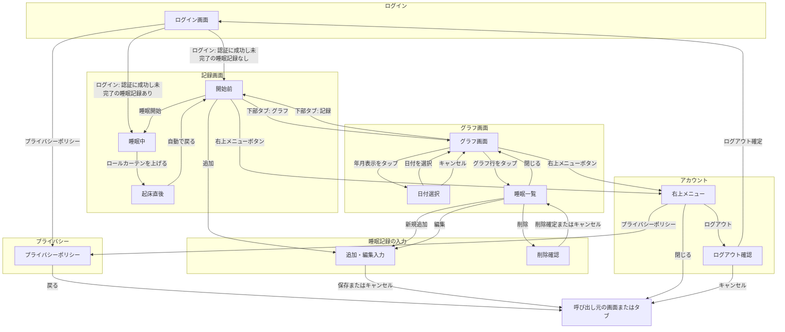

# 初回リリース詳細仕様

## 位置づけ

この文書には、最初の完成版を実装するための詳細な仕様を記録する。

-   機能の一覧と優先順位は [requirements.md](requirements.md) を参照する。
-   この文書では、機能の重複した一覧は作らず、記録・集計・画面・操作フローなどの具体的な決定を記録する。

## アプリ全体の仕様

### 利用・アカウント方針

-   v0 では製作者だけが、睡眠記録の登録・編集・閲覧を行える。
-   ログインには、メールアドレスのみを使うパスワードレス認証を用いる。
-   取得・保存する個人情報は必要最小限にする。
-   プライバシーポリシーを独立した画面として用意し、ログイン前とログイン後のどちらからも確認できるようにする。具体的な記載内容は、利用する認証・保存サービスの選定後に決める。

### 睡眠記録の扱い

-   睡眠記録は、所有者、就寝日時、起床日時を持つ。睡眠時間は就寝日時と起床日時から計算する。
-   「ねた」の操作では、現在時刻を就寝日時として、起床日時が未入力の睡眠記録を作成する。
-   「おきた」の操作では、起床日時が未入力の睡眠記録に現在時刻を記録して完了する。
-   記録画面には、現在の睡眠状態に応じた開始または終了の操作だけを表示する。睡眠開始と終了の操作は同時に表示しない。
-   任意の日付・開始時刻・終了時刻を指定した追加、開始・終了時刻の編集、削除を行える。
-   昼寝や二度寝を含め、すべての睡眠を同じ睡眠記録として扱う。夜の睡眠だけを特別扱いしない。

### 睡眠日・日別集計・グラフ表示の定義

-   睡眠日は、起床した実際の暦日を基準にする。日付の区切りは 00:00 とする。
-   1 日の睡眠時間は、同じ睡眠日に起床したすべての睡眠記録の全時間を合算する。
-   グラフは、1 日につき 1 本の横棒で睡眠時間帯を表示する。1 日に複数回の睡眠がある場合は、同じ棒に複数の睡眠区間を表示する。
-   グラフの表示区切りは睡眠日と別に扱い、初期値は 16:00 とする。表示区切りをまたぐ睡眠は、表示上分割されてもよい。
-   グラフの各行は、表示区切りの開始日で表記する。たとえば「7/15」の行は、7/15 16:00 から 7/16 16:00 までを表す。
-   表示区切りは全利用者共通とし、管理者が設定ファイルなどで変更できる。変更後は、過去を含むすべてのグラフ表示に反映する。

### 端末ごとの表示方針

-   スマホ・タブレット・PC で、同じ機能と操作フローを提供する。
-   画面幅に応じて配置・サイズ・表示形式は変えてよいが、端末によって要素の追加・削除は行わない。
-   オーバーレイは、狭い画面ではボトムシートやモーダル、広い画面では中央のダイアログとして表示できる。

## 画面仕様と操作フロー

### 画面要素一覧

要素の種類は、次の表記で区別する。

-   `[表示]`：テキスト、状態、一覧、グラフなど、確認する情報
-   `[入力]`：文字や日付・時刻を入力・選択する項目
-   `[操作]`：同じ画面内で記録や表示の状態を変える操作
-   `[遷移]`：別の画面・入力画面・確認表示を開く操作

種別は、次の意味で使う。

-   `画面`：利用者が主に操作する画面。タブから開くものも含む。
-   `オーバーレイ`：元の画面の上に一時的に開き、完了・キャンセル・閉じる操作で元へ戻る表示。
-   `共通UI`：複数の画面で共通して表示する操作部。

記録開始前・睡眠中・起床直後は、1つの記録画面における表示状態とする。

| 名称 | 種別 | 状態 | 主な要素 |
| --- | --- | --- | --- |
| ログイン画面 | 画面 | コード送信前／送信後 | `[入力]` メールアドレス、コード、`[表示]` 送信先メールアドレス、共通のログイン失敗表示、`[操作]` コード送信、コード再送、ログイン、`[遷移]` プライバシーポリシー |
| 記録画面 | 画面 | 開始前 | `[操作]` 大きな睡眠開始ボタン、`[遷移]` 追加 |
| 記録画面 | 画面 | 睡眠中 | `[表示]` 睡眠中の状態、落ち着いた背景、操作案内、`[操作]` ロールカーテンを上げる起床記録 |
| 記録画面 | 画面 | 起床直後 | `[表示]` 明るい完了表示 |
| グラフ画面 | 画面 | — | `[表示]` 表示中の年月、グラフ本体、`[操作]` 初期表示へ戻る、`[遷移]` 日付選択、睡眠一覧 |
| 日付選択 | オーバーレイ | — | `[入力]` 日付、`[操作]` 日付を選択、キャンセル |
| 睡眠一覧 | オーバーレイ | — | `[表示]` 表示期間、睡眠記録一覧、末尾の「新規追加」、`[操作]` 閉じる、`[遷移]` 新規追加、編集、削除確認 |
| 追加・編集入力 | オーバーレイ | 追加／編集 | `[入力]` 開始日時、終了日時、`[操作]` 保存、キャンセル |
| 削除確認 | オーバーレイ | — | `[表示]` 確認メッセージ、`[操作]` 削除確定、キャンセル |
| プライバシーポリシー | 画面 | — | `[表示]` ポリシー本文、`[遷移]` 前画面へ戻る |
| 右上メニューボタン | 共通UI | — | `[遷移]` 右上メニュー |
| 右上メニュー | オーバーレイ | — | `[操作]` 閉じる、`[遷移]` プライバシーポリシー、ログアウト確認 |
| ログアウト確認 | オーバーレイ | — | `[表示]` 確認メッセージ、`[操作]` ログアウト確定、キャンセル |
| 下部タブ | 共通UI | — | `[遷移]` 記録画面、グラフ画面 |

### 画面遷移図

矢印のラベルは、遷移を起こすボタン・リンク・操作を表す。画面内だけで状態を変える操作（コード送信・コード再送など）は、図ではなく画面要素一覧とログイン仕様に記載する。ログイン状態の有無など、利用者の操作を伴わない初期表示の判定は図から省く。

- 記録画面とグラフ画面には、共通の下部タブを表示する。
- 記録画面とグラフ画面には、共通の右上メニューを表示する。
- 図中の「呼び出し元」は画面ではなく、右上メニュー・プライバシーポリシー・ログアウト確認・追加・編集入力を開く前の画面またはタブを指す。

## 画面・共通UIの詳細仕様

画面・オーバーレイ・共通UIは、原則として「表示」「入力・保存」「操作」「状態変化・遷移」の順で記載する。該当しない項目は「該当なし」とする。

### 下部タブ

#### 表示

-   通常時は、画面下部に「記録」と「グラフ」の 2 タブを表示する。
-   初回版では、ほかの画面をタブとして表示しない。追加・編集・ログインは、それぞれの操作に必要な画面として開く。
-   記録画面の睡眠中状態では下部タブを隠し、睡眠状態と起床記録に必要な表示だけにする。

#### 入力・保存

-   該当なし。

#### 操作

-   「記録」または「グラフ」のタブを選択する。

#### 状態変化・遷移

-   「記録」を選択すると記録画面の開始前状態を、「グラフ」を選択するとグラフ画面を表示する。

### 右上メニューボタン

#### 表示

-   記録画面とグラフ画面の右上に表示する。

#### 入力・保存

-   該当なし。

#### 操作

-   右上メニューボタンを選択する。

#### 状態変化・遷移

-   右上メニューを開く。

### 右上メニュー

#### 表示

-   「プライバシーポリシー」と「ログアウト」を表示する。

#### 入力・保存

-   該当なし。

#### 操作

-   メニューを閉じる。
-   「プライバシーポリシー」または「ログアウト」を選択する。

#### 状態変化・遷移

-   閉じると、呼び出し元の画面またはタブへ戻る。
-   「プライバシーポリシー」を選択すると、プライバシーポリシー画面を開く。
-   「ログアウト」を選択すると、ログアウト確認を開く。

### プライバシーポリシー

#### 表示

-   プライバシーポリシー本文を表示する。

#### 入力・保存

-   該当なし。

#### 操作

-   前画面へ戻る。

#### 状態変化・遷移

-   前画面へ戻ると、呼び出し元の画面またはタブを表示する。

### ログアウト確認

#### 表示

-   ログアウトするか確認するメッセージを表示する。

#### 入力・保存

-   該当なし。

#### 操作

-   ログアウト確定またはキャンセルを選択する。

#### 状態変化・遷移

-   ログアウト確定後はログイン画面を表示する。
-   キャンセルすると、呼び出し元の画面またはタブへ戻る。

### ログイン画面

#### 表示

-   有効なログイン状態がない場合は、1つのログイン画面を表示する。
-   ログイン画面には、メールアドレス入力欄、コード入力欄、コード送信、コード再送、ログイン、プライバシーポリシーへのリンクを置く。
-   最初はメールアドレス入力欄とコード送信だけを有効にし、コード入力欄とログインは無効にする。プライバシーポリシーへのリンクは常に利用できるようにする。
-   コード送信後は同じ画面内でコード入力欄とログインを有効にし、送信先メールアドレスとコード再送を表示する。
-   コードの誤り・期限切れ・許可されていないメールアドレスでは、原因を分けずに共通のログイン失敗メッセージを表示する。

#### 入力・保存

-   メールアドレスと、メールで受け取ったコードを入力する。
-   コード送信後にメールアドレスを変更した場合は、入力済みのコードを消去する。コード再送時も、入力済みのコードを消去する。

#### 操作

-   コード送信、コード再送、ログインを行える。
-   プライバシーポリシーへのリンクを選択できる。

#### 状態変化・遷移

-   コード送信後は、コード再送信が必要な状態からコード入力・ログインが可能な状態へ切り替える。
-   メールアドレスを変更した場合は、コード再送信が必要な状態へ戻す。
-   ログインボタンを押すと、入力したコードで本人確認する。成功後は、未完了の睡眠記録があれば記録画面の睡眠中状態を、なければ記録画面の開始前状態を表示する。
-   ログイン失敗時も、メールアドレスの編集・コード再送は引き続き行える。
-   v0 ではアプリ内の新規登録画面を設けず、管理者設定で許可したメールアドレス 1 件だけがログインできる。

### 記録画面：開始前

#### 表示

-   睡眠開始を記録する大きなボタンを表示する。
-   直近の睡眠の概要は表示しない。

#### 入力・保存

-   該当なし。

#### 操作

-   睡眠開始ボタンを選択する。確認は表示しない。
-   追加を選択する。

#### 状態変化・遷移

-   睡眠開始ボタンを選択した時刻を開始時刻として記録し、睡眠中状態へ切り替える。
-   追加を選択すると、追加・編集入力を開く。

### 記録画面：睡眠中

#### 表示

-   未完了の睡眠記録がある間は、どの端末で開いても記録画面の睡眠中状態を表示する。端末ごとに表示状態を分けず、睡眠中はグラフにも移動しない。
-   睡眠中であることが分かる表示にする。
-   睡眠導入を妨げない、落ち着いた背景にする。
-   起床記録に必要な操作以外は、できるだけ情報や操作を表示しない。

#### 入力・保存

-   該当なし。

#### 操作

-   画面下部の取っ手を上へ引き上げて、ロールカーテンを開く。

#### 状態変化・遷移

-   ロールカーテンを開く操作で、起床時刻を記録して睡眠記録を完了する。誤タップを防ぎつつ、寝起きでも 1 回の操作で完了できるようにする。
-   起床記録が完了すると、暗い睡眠中状態の表示が上へ巻き上がり、明るい起床直後状態の表示が現れる演出にする。

### 記録画面：起床直後

#### 表示

-   起床記録が完了した直後は、明るい背景の短時間の完了表示を出す。

#### 入力・保存

-   該当なし。

#### 操作

-   該当なし。

#### 状態変化・遷移

-   追加の操作は求めず、数秒後に記録画面の開始前状態へ自動的に戻す。

### グラフ画面

#### 表示

-   画面上部には、表示中の年月と任意の過去へ移動する入口を置く。
-   グラフ本体は、1 日 1 行の横棒グラフを表示する。
-   日付は、古い順に上から下へ表示する。
-   初期表示は現在月の今日付近とし、数日前から今日までが見える位置を基準にする。最初に画面内へ表示する日数は、端末ごとの画面デザインを確認してから調整する。
-   時間軸は 16:00 始まりとし、4 時間ごとに目盛線を表示する。
-   時刻の数字を表示する間隔は、画面デザインを確認してから調整する。
-   v0 ではすべての睡眠区間を同じ 1 色で表示する。睡眠・目覚めの評価による色分けは将来検討する。
-   睡眠記録がない日も、睡眠がない時間帯と同じ背景色の行を 24 時間分表示し、記録がないことを分かるようにする。
-   各行の左側には、日付と曜日を表示する。曜日ごとの色分けは、画面デザインを確認してから検討する。

#### 入力・保存

-   該当なし。

#### 操作

-   縦スクロールで、上方向へ過去の日付へ連続してさかのぼる。
-   上部の年月表示を選択する。
-   初期表示へ戻る操作を行える。日付の並び順にかかわらず、グラフ画面を最初に開いたときと同じ位置・表示量へ戻す。
-   グラフ行のどこを選択しても、その行の表示期間の睡眠一覧を開く。

#### 状態変化・遷移

-   年月表示を選択すると日付選択を開く。
-   グラフ行を選択すると睡眠一覧を開く。

### 日付選択

#### 表示

-   カレンダーで日付を選ぶ表示を、グラフ画面の上に開く。

#### 入力・保存

-   日付を選択する。

#### 操作

-   日付を選択せずにキャンセルできる。

#### 状態変化・遷移

-   日付を選ぶと、選んだ日付を含む位置へ直接移動してグラフ画面を表示する。
-   キャンセルすると、グラフ画面へ戻る。

### 睡眠一覧

#### 表示

-   睡眠一覧はグラフ画面の上に重ねて開く。
-   対象の表示期間を「7/15 16:00〜7/16 16:00」のように明示し、その期間と少しでも重なる睡眠記録を、元の開始・終了日時と睡眠時間で一覧表示する。
-   末尾には、睡眠記録と近い見た目の「新規追加」行を表示する。これは実データではない。睡眠記録がない場合は「新規追加」行だけを表示する。

#### 入力・保存

-   該当なし。

#### 操作

-   睡眠一覧を閉じる。
-   「新規追加」を選択する。
-   一覧の各睡眠記録から編集または削除を選択する。

#### 状態変化・遷移

-   閉じると、グラフ画面へ戻る。
-   「新規追加」を選択すると、追加・編集入力を追加状態で開く。
-   編集を選択すると、一覧を追加・編集入力に置き換え、現在の日時を入力済みにした編集状態で開く。
-   削除を選択すると、削除確認を睡眠一覧の上に開く。
-   表示区切りをまたぐ睡眠記録は、前後どちらの行からも同じ元の記録を開ける。

### 追加・編集入力

#### 表示

-   現在の画面の上に小さく開く形式にする。

#### 入力・保存

-   就寝した日付と時刻、起床した日付と時刻を直接入力する。睡眠日は入力させず、起床日時から自動計算する。
-   保存時に、起床日時が就寝日時より後であることを確認する。

#### 操作

-   保存またはキャンセルを選択する。

#### 状態変化・遷移

-   追加は、記録画面または睡眠一覧から同じ入力を開く。
-   保存に成功したら入力を閉じ、元の画面をすぐに更新する。キャンセル時は変更せずに閉じる。
-   睡眠一覧から開いた編集の保存・キャンセル後は、睡眠一覧へ戻る。

### 削除確認

#### 表示

-   誤操作防止の確認メッセージを、睡眠一覧の上に表示する。

#### 入力・保存

-   該当なし。

#### 操作

-   削除確定またはキャンセルを選択する。

#### 状態変化・遷移

-   削除確定後は、睡眠一覧とグラフを更新する。
-   削除確定・キャンセルのどちらでも、睡眠一覧へ戻る。
