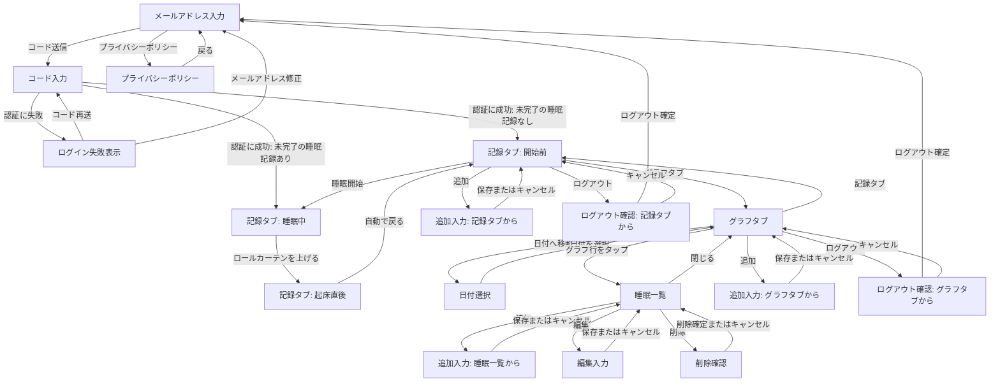

# 初回リリース詳細仕様

## 位置づけ

この文書には、最初の完成版を実装するための詳細な仕様を記録する。

-   機能の一覧と優先順位は [requirements.md](requirements.md) を参照する。
-   この文書では、機能の重複した一覧は作らず、記録・集計・画面・操作フローなどの具体的な決定を記録する。

## 決定済み仕様

### 睡眠記録

-   睡眠記録は、所有者、就寝日時、起床日時を持つ。睡眠時間は就寝日時と起床日時から計算する。
-   「ねた」の操作では、現在時刻を就寝日時として、起床日時が未入力の睡眠記録を作成する。
-   「おきた」の操作では、起床日時が未入力の睡眠記録に現在時刻を記録して完了する。
-   記録画面には、現在の睡眠状態に応じた次の操作だけを表示する。睡眠開始と終了の操作は同時に表示しない。
-   任意の日付・開始時刻・終了時刻を指定した追加、開始・終了時刻の編集、削除を行える。
-   昼寝や二度寝を含め、すべての睡眠を同じ睡眠記録として扱う。夜の睡眠だけを特別扱いしない。

### 睡眠日と日別集計

-   睡眠日は、起床した実際の暦日を基準にする。日付の区切りは 00:00 とする。
-   1 日の睡眠時間は、同じ睡眠日に起床したすべての睡眠記録の全時間を合算する。

### グラフ

-   グラフは、1 日につき 1 本の横棒で睡眠時間帯を表示する。1 日に複数回の睡眠がある場合は、同じ棒に複数の睡眠区間を表示する。
-   グラフの表示区切りは睡眠日と別に扱い、初期値は 16:00 とする。表示区切りをまたぐ睡眠は、表示上分割されてもよい。
-   グラフの各行は、表示区切りの開始日で表記する。たとえば「7/15」の行は、7/15 16:00 から 7/16 16:00 までを表す。
-   表示区切りは全利用者共通とし、管理者が設定ファイルなどで変更できる。変更後は、過去を含むすべてのグラフ表示に反映する。
-   グラフの初期表示は現在月の今日付近とし、任意の過去の期間へ直接移動できる。

### アカウントとプライバシー

-   v0 では製作者だけが、睡眠記録の登録・編集・閲覧を行える。
-   ログインには、メールアドレスのみを使うパスワードレス認証を用いる。
-   取得・保存する個人情報は必要最小限にする。
-   プライバシーポリシーを独立した画面として用意し、ログイン前に確認できるようにする。具体的な記載内容は、利用する認証・保存サービスの選定後に決める。

## 画面仕様と操作フロー

### 画面要素一覧

要素の種類は、次の表記で区別する。

-   `[表示]`：テキスト、状態、一覧、グラフなど、確認する情報
-   `[入力]`：文字や日付・時刻を入力・選択する項目
-   `[操作]`：同じ画面内で記録や表示の状態を変える操作
-   `[遷移]`：別の画面・入力画面・確認表示を開く操作

| 機能・カテゴリ | 画面・状態           | 主な要素                                                                                                                 |
| -------------- | -------------------- | ------------------------------------------------------------------------------------------------------------------------ |
| ログイン       | メールアドレス入力   | `[入力]` メールアドレス、`[操作]` コード送信、`[遷移]` プライバシーポリシー                                              |
| ログイン       | コード入力           | `[入力]` コード、`[表示]` 送信先メールアドレス・共通のログイン失敗表示、`[操作]` コード再送、`[遷移]` メールアドレス修正 |
| 記録タブ       | 開始前               | `[操作]` 大きな睡眠開始ボタン・ログアウト、`[遷移]` 記録・グラフタブ・追加                                               |
| 記録タブ       | 睡眠中               | `[表示]` 睡眠中の状態・落ち着いた背景・操作案内、`[操作]` ロールカーテンを上げる起床記録                                 |
| 記録タブ       | 起床直後             | `[表示]` 明るい完了表示                                                                                                  |
| グラフタブ     | グラフ               | `[表示]` 表示期間・グラフ本体、`[操作]` 日付へ移動・初期表示へ戻る・ログアウト、`[遷移]` 追加・睡眠一覧                  |
| グラフタブ     | 睡眠一覧             | `[表示]` 表示期間・睡眠記録一覧・空の場合の `—`、`[遷移]` 追加・編集・削除確認                                           |
| 睡眠記録の入力 | 追加・編集           | `[入力]` 開始日時・終了日時、`[操作]` 保存・キャンセル                                                                   |
| 睡眠記録の入力 | 削除確認             | `[表示]` 確認メッセージ、`[操作]` 削除確定・キャンセル                                                                   |
| プライバシー   | プライバシーポリシー | `[表示]` ポリシー本文、`[遷移]` 前画面へ戻る                                                                             |
| アカウント     | ログアウト確認       | `[表示]` 確認メッセージ、`[操作]` ログアウト確定・キャンセル                                                             |

### 画面遷移図

矢印のラベルは、遷移を起こすボタン・リンク・操作を表す。ログイン状態の有無など、利用者の操作を伴わない初期表示の判定は図から省く。

### ナビゲーション

-   通常時は、画面下部に「記録」と「グラフ」の 2 タブを表示する。
-   初回版では、ほかの画面をタブとして表示しない。追加・編集・ログインは、それぞれの操作に必要な画面として開く。
-   睡眠中は下部タブを隠し、睡眠状態と起床記録に必要な表示だけにする。

### 記録開始前（睡眠中の記録がない状態）

-   睡眠開始を記録する大きなボタンを表示する。
-   睡眠開始ボタンは確認なしで、タップ直後の時刻を開始時刻として記録する。記録後は睡眠中画面へ切り替える。
-   直近の睡眠の概要は表示しない。

### 睡眠中（起床日時が未入力の状態）

-   未完了の睡眠記録がある間は、どの端末で開いても睡眠中画面を表示する。端末ごとに表示状態を分けず、睡眠中はグラフにも移動しない。
-   睡眠中であることが分かる表示にする。
-   睡眠導入を妨げない、落ち着いた背景にする。
-   起床記録に必要な操作以外は、できるだけ情報や操作を表示しない。
-   起床記録は、画面下部の取っ手を上へ引き上げてロールカーテンを開く操作で完了する。誤タップを防ぎつつ、寝起きでも 1 回の操作で完了できるようにする。
-   起床記録が完了すると、暗い睡眠中画面が上へ巻き上がり、明るい起床後画面が現れる演出にする。

### 起床記録の完了後

-   起床記録が完了した直後は、明るい背景の短時間の完了表示を出す。
-   追加の操作は求めず、数秒後に通常の記録開始前画面へ自動的に戻す。

### 追加

-   追加への入口は、記録タブとグラフ画面の両方に置く。
-   どちらの入口からも、同じ追加の入力画面を開く。
-   追加の入力画面は、現在の画面の上に小さく開く形式にする。
-   就寝した日付と時刻、起床した日付と時刻を直接入力する。睡眠日は入力させず、起床日時から自動計算する。
-   保存時に、起床日時が就寝日時より後であることを確認する。
-   保存に成功したら入力画面を閉じ、元の画面をすぐに更新する。キャンセル時は変更せずに閉じる。
-   編集はグラフの睡眠一覧から行う。編集時は、睡眠一覧を入力画面に置き換え、現在の日時を入力済みにした同じ入力画面を開く。保存・キャンセル後は睡眠一覧へ戻る。
-   削除はグラフの睡眠一覧から行う。削除時は、睡眠一覧の上に誤操作防止の確認を 1 回表示する。確認後は睡眠一覧とグラフを更新する。

### 端末ごとの表示

-   スマホ・タブレット・PC で、同じ機能と操作フローを提供する。
-   画面幅に応じて配置・サイズ・表示形式は変えてよいが、端末によって要素の追加・削除は行わない。
-   たとえば追加は、狭い画面ではボトムシートやモーダル、広い画面では中央のダイアログとして表示できる。

### グラフ画面で未決定の事項

-   特になし。

### グラフ画面の基本構成

-   画面上部には、表示中の期間、任意の過去へ移動する入口、追加の入口を置く。
-   グラフ本体は、1 日 1 行の横棒グラフを表示する。
-   日付は、古い順に上から下へ表示する。
-   初期表示は現在月の今日付近とし、数日前から今日までが見える位置を基準にする。最初に画面内へ表示する日数は、端末ごとの画面デザインを確認してから調整する。
-   縦スクロールで、上方向へ過去の日付へ連続してさかのぼれるようにする。
-   上部の「日付へ移動」から、指定した日付付近のグラフへ直接移動できるようにする。
-   「日付へ移動」は、表示中の期間をタップしてカレンダーを開き、日付を選ぶ方式にする。選んだ日付を含む位置へ移動する。
-   初期表示へ戻る操作を置く。日付の並び順にかかわらず、グラフ画面を最初に開いたときと同じ位置・表示量へ戻す。
-   時間軸は 16:00 始まりとし、4 時間ごとに目盛線を表示する。
-   時刻の数字を表示する間隔は、画面デザインを確認してから調整する。
-   v0 ではすべての睡眠区間を同じ 1 色で表示する。睡眠・目覚めの評価による色分けは将来検討する。
-   睡眠記録がない日も、睡眠がない時間帯と同じ背景色の行を 24 時間分表示し、記録がないことを分かるようにする。
-   各行の左側には、日付と曜日を表示する。曜日ごとの色分けは、画面デザインを確認してから検討する。

### グラフからの睡眠一覧・編集

-   グラフ行のどこをタップしても、その行の表示期間の睡眠一覧を開く。
-   睡眠一覧は現在の画面の上に重ねて開く。狭い画面ではボトムシートやモーダル、広い画面では中央のダイアログとして表示できる。
-   睡眠一覧には、対象の表示期間を「7/15 16:00〜7/16 16:00」のように明示し、その期間と少しでも重なる睡眠記録を、元の開始・終了日時と睡眠時間で一覧表示する。
-   睡眠一覧に睡眠記録がない場合は、`—` のような空のプレースホルダー行を表示する。これは実データではなく追加の入口とし、タップすると追加の入力画面を開く。
-   一覧の各睡眠記録から編集・削除を行える。
-   表示区切りをまたぐ睡眠記録は、前後どちらの行からも同じ元の記録を開ける。

### 初回ログイン

-   有効なログイン状態がない場合は、メールアドレスの入力画面を表示する。
-   メールアドレス入力画面から、プライバシーポリシー画面を開けるようにする。
-   v0 ではアプリ内の新規登録画面を設けず、管理者設定で許可したメールアドレス 1 件だけがログインできる。
-   メールアドレス入力後にワンタイムコードを送信し、利用者はアプリ上でコードを入力して本人確認する。
-   コード入力画面には、コードの入力欄、送信先メールアドレス、コード再送、メールアドレス修正の操作を表示する。
-   コードの誤り・期限切れ・許可されていないメールアドレスでは、原因を分けずに共通のログイン失敗メッセージを表示する。メールアドレス修正・コード再送は引き続き行える。
-   本人確認が完了したら、記録タブを表示する。

### ログアウト

-   記録・グラフ画面には、独立したログアウトボタンを表示する。
-   ログアウトボタンを押すと確認メッセージとログアウト確定ボタンを表示し、確認後にログアウトする。キャンセルもできるようにする。
